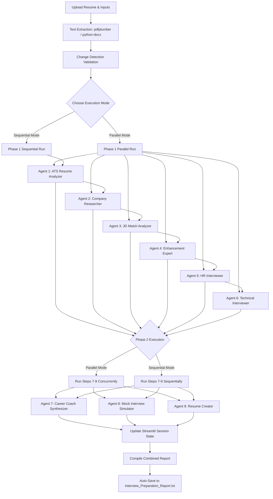

# Resume-to-Interview Preparation Assistant 🚀

An interactive, AI-powered multi-agent web application built with **Streamlit** and **CrewAI** that automates the process of tailoring your resume and preparing for interviews. By uploading a resume (PDF/DOCX) and entering a target role, company name, and job description, the assistant deploys a team of specialized AI agents to analyze, research, and coach you to success.

---

## 🛠️ Required Libraries & Ecosystem

The project leverages a modern Python-based AI and web stack. Below are the key libraries utilized and their roles:

1. **`streamlit`**
   * **Role**: Frontend framework.
   * **Purpose**: Provides a responsive, web-based UI for uploading resumes, entering target roles, selecting AI models, tracking agent statuses in real time, and displaying/downloading generated reports.
2. **`crewai`**
   * **Role**: Agentic AI framework.
   * **Purpose**: Defers tasks to specialized agents (e.g., ATS Analyzer, Technical Interviewer). It configures their role, goals, backstories, LLM integrations, and expected outputs.
3. **`pdfplumber`**
   * **Role**: PDF text extraction.
   * **Purpose**: Programmatically opens and extracts text from uploaded PDF resumes while preserving content layout.
4. **`python-docx` (`docx`)**
   * **Role**: DOCX text extraction.
   * **Purpose**: Opens and parses Word documents (`.docx`), extracting paragraphs into plain text.
5. **`nest-asyncio`**
   * **Role**: Event loop utility.
   * **Purpose**: Patches the standard asyncio event loop to allow nested event loops. This is critical because Streamlit runs in an async loop, and CrewAI invokes async functions inside its orchestration.
6. **`concurrent.futures` (`ThreadPoolExecutor`)**
   * **Role**: Concurrency tool.
   * **Purpose**: Manages multi-threaded execution for parallel agent runs, allowing multiple LLM queries to fire concurrently.
7. **`tempfile` & `os`**
   * **Role**: File system utilities.
   * **Purpose**: Writes uploaded resume memory buffers to temporary files on disk so they can be processed by parsing libraries.

---

## 🔄 How the Project Works (Detailed Procedure)

The system works through a structured pipeline starting from user inputs to multi-agent reasoning, culminating in a local file output and download options.



### Step 1: Input and Configuration
1. The user inputs their **OpenRouter API Key** (masked in password format).
2. The user selects a language model from the select box:
   * `meta-llama/llama-3.3-70b-instruct` (Default)
   * `google/gemini-2.5-flash`
   * `deepseek/deepseek-chat`
   * `anthropic/claude-3.5-sonnet`
3. The user uploads a resume and enters the target **Role**, **Company Name**, and **Job Description (JD)**.

### Step 2: Resume Text Extraction
When a resume file is uploaded:
* The system checks the file extension.
* For **PDFs**, it uses `pdfplumber` to iterate through pages and extract plain text.
* For **DOCX** files, it uses `python-docx` to loop through paragraphs and merge them.
* The extracted text is stored in memory as a string.

### Step 3: Change Detection & Cache Resetting
To prevent duplicate API calls, all generated reports are cached in Streamlit's `st.session_state`. 
* The system continuously monitors inputs (`uploaded_filename`, `job_role`, `company_name`, `job_description`, `model_option`).
* If any of these values change, the system clears all 9 cached outputs and resets the generation state.

### Step 4: Multi-Agent Orchestration & Execution
The application features two different execution pathways for running the agents:

#### A. Parallel Execution (Fast Mode)
This mode executes tasks concurrently to minimize overall wait times:
1. **Phase 1 (Independent Steps)**: The app launches a `ThreadPoolExecutor` with a pool of 6 threads. Steps 1 through 6 run concurrently:
   * **Step 1: ATS Resume Analysis** (Analyzes scores, strengths, weaknesses).
   * **Step 2: Company Research** (Examines hiring expectation and tech stack).
   * **Step 3: Job Description Match** (Identifies gaps & missing keywords).
   * **Step 4: Resume Enhancement** (Prepares rewrite tips).
   * **Step 5: HR Interviewer** (Creates 5 behavioral questions & answers).
   * **Step 6: Technical Interviewer** (Generates 5 technical questions & answers).
2. **Phase 2 (Dependent Steps)**: Once Phase 1 completes, the app launches 3 concurrent threads for:
   * **Step 7: Career Coach Summary** (Synthesizes results from Steps 1–6 into a 30-day roadmap).
   * **Step 8: Mock Interview Simulator** (Simulates a complete mock interview).
   * **Step 9: Resume Creator** (Uses Step 4 suggestions to build an improved copy-paste Markdown resume).

#### B. Sequential Execution (Step-by-Step Mode)
This mode processes steps one by one, allowing users to watch the progress incrementally:
1. The app finds the first ungenerated step in the workflow.
2. It initiates the corresponding agent, runs the task, and saves the output in `st.session_state`.
3. It triggers a page rerun (`st.rerun()`) to update the UI with a completed badge and instantly launches the next step.

### Step 5: Report Synthesis & Saving
1. After reports are generated, the app compiles them into a unified, formatted document containing custom delimiters.
2. The compiled report is automatically saved to the local file:
   * **`Interview_Preparation_Report.txt`**
3. Users can review the combined output in an interactive text area or download individual module outputs as separate text files.

---

## 📦 Setup & Installation

### Prerequisites
* Python 3.10 or higher
* An **OpenRouter API Key** (obtain one at [openrouter.ai/keys](https://openrouter.ai/keys))

### Installation Steps

1. **Clone or Download the Project**:
   Ensure all files are placed in your working directory.

2. **Set Up a Virtual Environment** (Recommended):
   ```bash
   # Create a virtual environment
   python -m venv .venv
   
   # Activate on Windows (PowerShell)
   & .venv\Scripts\Activate.ps1
   
   # Activate on Windows (Command Prompt)
   .venv\Scripts\activate
   ```

3. **Install Dependencies**:
   ```bash
   pip install -r requirements.txt
   ```

4. **Run the Streamlit App**:
   ```bash
   streamlit run Multi-Agent-Placement.py
   ```

---

## 📁 File Structure

* **[Multi-Agent-Placement.py](file:///c:/Users/penug/OneDrive/Desktop/Gen%20AI/Multi-Agent-Placement.py)**: The main Streamlit web app integrating Streamlit UI, Session State management, multi-threaded execution, and CrewAI agent/task definitions.
* **[requirements.txt](file:///c:/Users/penug/OneDrive/Desktop/Gen%20AI/requirements.txt)**: List of Python packages required for the project.
* **[Interview_Preparation_Report.txt](file:///c:/Users/penug/OneDrive/Desktop/Gen%20AI/Interview_Preparation_Report.txt)**: Locally generated output containing a sample compiled report preview.
* **[README.md](file:///c:/Users/penug/OneDrive/Desktop/Gen%20AI/README.md)**: Documentation on project capabilities, installation, design, and internal details.
